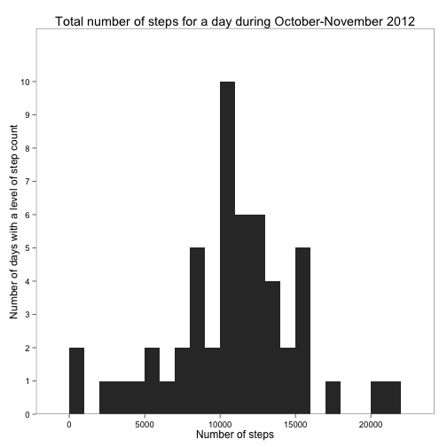
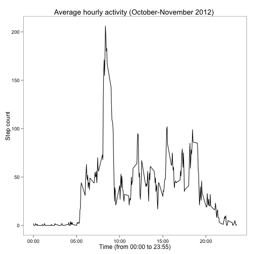
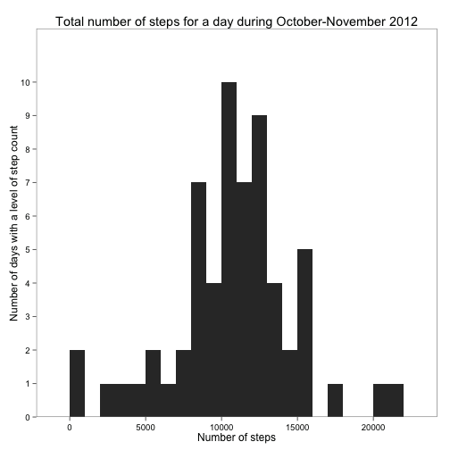
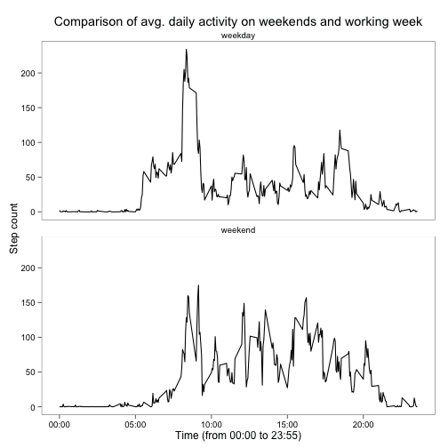

# Reproducible Research: Peer Assessment 1

## Preparing the environment


```r
if(require("plyr")){
  print("plyr is loaded correctly")
} else {
  print("trying to install plyr")
  install.packages("downloader")
  if(require(downloader)){
    print("plyr installed and loaded")
  } else {
    stop("could not install required packages (plyr)")
  }
}
```

```
## Loading required package: plyr
```

```
## [1] "plyr is loaded correctly"
```

```r
if(require("data.table")){
  print("data.table is loaded correctly")
} else {
  print("trying to install data.table")
  install.packages("data.table")
  if(require(data.table)){
    print("data.table installed and loaded")
  } else {
    stop("could not install required packages (data.table)")
  }
}
```

```
## Loading required package: data.table
```

```
## [1] "data.table is loaded correctly"
```

```r
if(require("ggplot2")){
  print("ggplot2 is loaded correctly")
} else {
  print("trying to install ggplot2")
  install.packages("ggplot2")
  if(require(ggplot2)){
    print("ggplot2 installed and loaded")
  } else {
    stop("could not install required packages (ggplot2)")
  }
}
```

```
## Loading required package: ggplot2
```

```
## [1] "ggplot2 is loaded correctly"
```

```r
if(require("ggthemes")){
  print("ggthemes is loaded correctly")
} else {
  print("trying to install ggthemes")
  install.packages("ggthemes")
  if(require(ggthemes)){
    print("ggthemes installed and loaded")
  } else {
    stop("could not install required packages (ggthemes)")
  }
}
```

```
## Loading required package: ggthemes
```

```
## [1] "ggthemes is loaded correctly"
```


## Loading and preprocessing the data


```r
setwd('/Users/majulass/Documents/2014/reproducible-research/peer-assesment-01')
unzip('activity.zip')
activity.df <- read.csv('activity.csv')
activity.df$date <- as.Date(activity.df$date)
```

```r
# Prepare dataset for later steps
# Construct timestamps.
activity.df$length <- mapply(nchar, activity.df$interval)
activity.df$hourstamp <- NA
activity.df[activity.df$length == 1,]$hourstamp<-paste('000',activity.df[activity.df$length == 1,]$interval, sep='')
activity.df[activity.df$length == 2,]$hourstamp <- paste('00',activity.df[activity.df$length == 2,]$interval, sep='')
activity.df[activity.df$length == 3,]$hourstamp <- paste('0',activity.df[activity.df$length == 3,]$interval, sep='')
activity.df[activity.df$length == 4,]$hourstamp <- activity.df[activity.df$length == 4,]$interval

activity.df$timestamp <- paste(activity.df$date,activity.df$hourstamp)
activity.df$posixts <- strptime(activity.df$timestamp, format="%Y-%m-%d %H%M")
activity.df$timestamp <- strftime(activity.df$posixts)
activity.df$weekday <- weekdays(as.Date(activity.df$date))
activity.df$weekday.factor <- 'weekday'
activity.df[activity.df$weekday %in% c('Saturday','Sunday'),]$weekday.factor <- 'weekend'
```


## What is mean total number of steps taken per day?

Make a histogram of the total number of steps taken each day

```r
# Average step length is around 80cm, so histogram bin width of 1000 (eg. 800 meters of walk) seems reasonable
activity.daily.sums.df <- ddply(activity.df[!is.na(activity.df$steps),], ~date, summarise, sum=sum(steps, na.rm=TRUE))
ggplot(activity.daily.sums.df, aes(sum)) + 
  geom_histogram(binwidth=1000) + 
  scale_y_discrete() +
  labs(
    title = "Total number of steps for a day during October-November 2012",
    x="Number of steps",
    y="Number of days with a level of step count") +
  theme_few()
```

 

Calculate and report the mean and median total number of steps taken per day. For this part of the assignment, you can ignore the missing values in the dataset.

```r
mean(activity.daily.sums.df$sum)
```

```
## [1] 10766
```

```r
median(activity.daily.sums.df$sum)
```

```
## [1] 10765
```


## What is the average daily activity pattern?

Make a time series plot of the 5-minute interval (x-axis) and the average number of steps taken, averaged across all days (y-axis)


```r
activity.dt <- data.table(activity.df)
hourly.averaged.steps.dt<-activity.dt[,round(mean(steps, na.rm=TRUE), digits=0),by=c("hourstamp")]

hour.labels<- c('00:00','05:00','10:00','15:00','20:00','23:55') 

ggplot(hourly.averaged.steps.dt, aes(x=as.numeric(hourstamp)) ) + 
  geom_line( aes(y = V1 ) ) +
  scale_x_continuous(labels=hour.labels) +
  labs(title = "Average hourly activity (October-November 2012) ", x="Time (from 00:00 to 23:55)", y="Step count") +
  theme_few()
```

 

Which 5-minute interval, on average across all the days in the dataset, contains the maximum number of steps?

```r
max_steps_time<-hourly.averaged.steps.dt[which.max(hourly.averaged.steps.dt$V1),]$hourstamp
max_steps_time<-paste(substr(max_steps_time, start = 1, stop = 2),':',substr(max_steps_time, start = 3, stop = 4),sep='')
```
The 5 minute interval beginning from **08:35** o'clock has the maximum activity on the average.


## Imputing missing values

Calculate and report the total number of missing values in the dataset (i.e. the total number of rows with NAs)

```r
sum(is.na(activity.dt$steps))
```

```
## [1] 2304
```


Creating a new dataset that is equal to the original dataset but with the missing data filled in. 


```r
averaged.daily.steps.dt<-activity.dt[,as.integer(round(mean(steps, na.rm=TRUE), digits=0)),by=c("weekday","hourstamp")]

activity.imputed.dt <- activity.dt <- data.table(activity.df)

activity.imputed.dt[is.na(activity.imputed.dt$steps)] <- activity.imputed.dt[is.na(steps),
   steps:=averaged.daily.steps.dt[averaged.daily.steps.dt$weekday==weekday 
                         & averaged.daily.steps.dt$hourstamp==hourstamp,]$V1]
```
The strategy here is to replace missing values with averaged value of particular day and measurement interval, eg. if there's is a missing value at Monday 12:00, it is replaced with averaged value of all measurements taken on Mondays at 12 o'clock.


Make a histogram of the total number of steps taken each day and calculate and report the mean and median total number of steps taken per day.

1. Do these values differ from the estimates from the first part of the assignment?
1. What is the impact of imputing missing data on the estimates of the total daily number of steps?


```r
# Average step length is around 80cm, so histogram bin width of 1000 (eg. 800 meters of walk) seems reasonable
activity.imputed.daily.sums.dt <- ddply(activity.imputed.dt, ~date, summarise, sum=sum(steps))
ggplot(activity.imputed.daily.sums.dt, aes(sum)) +
  geom_histogram(binwidth=1000) + 
  scale_y_discrete() +
  labs(
    title = "Total number of steps for a day during October-November 2012",
    x="Number of steps",
    y="Number of days with a level of step count") +
  theme_few()
```

 

```r
mean(activity.imputed.daily.sums.dt$sum)
```

```
## [1] 10765
```

```r
median(activity.imputed.daily.sums.dt$sum)
```

```
## [1] 10765
```
It seems that the impact of imputing missing values has no significant effect on the mean and median. However, from histogram it can be seen that there's a slight difference on the activity profile around median number of steps (10000+-2500 steps).


## Are there differences in activity patterns between weekdays and weekends?


```r
activity.dt <- data.table(activity.df)
hourly.averaged.steps.dt<-activity.dt[,mean(steps, na.rm=TRUE),by=c("hourstamp",'weekday.factor')]

hour.labels<- c('00:00','05:00','10:00','15:00','20:00','23:55') 

ggplot(hourly.averaged.steps.dt, aes(x=as.numeric(hourstamp)) ) + 
  geom_line( aes(y = V1 ) ) +
  scale_x_continuous(labels=hour.labels) +
  facet_wrap(~ weekday.factor, nrow=2, ncol=1) +
  labs(title = "Comparison of avg. daily activity on weekends and working week", x="Time (from 00:00 to 23:55)", y="Step count") +
  theme_few()
```

 

During weekends, the active period of day starts slightly later, and the pattern of the daily activity is more sporadic. During weekdays, the activity level during the working hours is lower compared to weekends.
